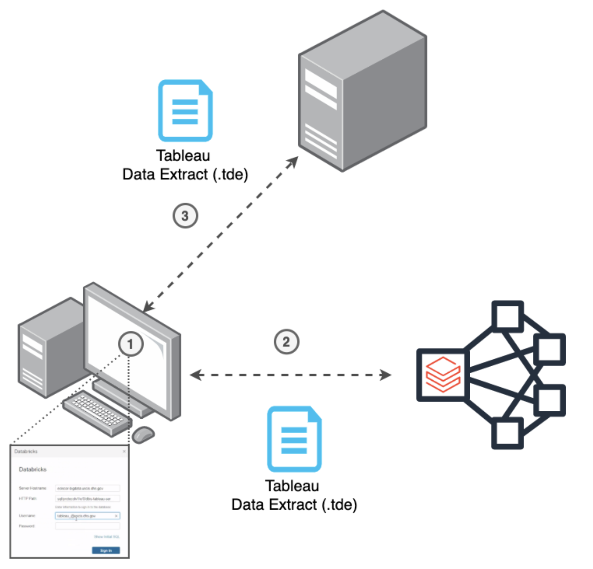

# hyperleaup
Pronounced "hyper-loop". Create and publish Tableau Hyper files from Apache Spark DataFrames or Spark SQL.

## Why are data extracts are _so slow_?
Tableau Data Extracts can take hours to create and publish to a Tableau Server.
Sometimes this means waiting around most of the day for the data extract to complete.
What a waste of time! In addition, the Tableau Backgrounder (the Tableau Server job scheduler)
becomes a single point of failure as more refresh jobs are scheduled and long running jobs exhaust the server’s resources.



## How hyperleaup helps
Rather than pulling data from the source over an ODBC connection, `hyperleaup` can write data directly to a Hyper file
and publish final Hyper files to a Tableau Server. Best of all, you can take advantage of all the benefits of 
Apache Spark + Tableau Hyper API:
- perform efficient CDC upserts
- distributed read/write/transformations from multiple sources
- execute SQL directly

`hyperleaup` allows you to create repeatable data extracts that can be scheduled to run on a repeated frequency
or even incorporate it as a final step in an ETL pipeline, e.g. refresh data extract with latest CDC.

## Getting Started
A list of usage examples is available in the `demo` folder of this repo as a [Databricks Notebook Archive (DBC)](demo/Hyperleaup-Demo.dbc).

## Example usage
The following code snippet creates a Tableau Hyper file from a Spark SQL statement and publishes it as a datasource to a Tableau Server.

```python
from hyperleaup import HyperFile

# Step 1: Create a Hyper File from Spark SQL
query = """
select *
  from transaction_history
 where action_date > '2015-01-01'
"""
hf = HyperFile(name="transaction_history", sql=query, is_dbfs_enabled=True)


# Step 2: Publish Hyper File to a Tableau Server
hf.publish(tableau_server_url,
           username,
           password,
           site_name,
           project_name,
           datasource_name)

# Step 3: Append new data
new_data = """
select *
  from transaction_history
 where action_date > last_publish_date
"""
hf.append(sql=new_data)
```

## Legal Information
This software is provided **as-is** and is not officially supported by Databricks through customer technical support channels.
Support, questions, and feature requests can be submitted through the Issues page of this repo.
Please understand that issues with the use of this code will not be answered or investigated by Databricks Support.  

## Core Contribution team
* Lead Developer: [Will Girten](https://www.linkedin.com/in/willgirten/), RSA, Databricks
* Puru Shrestha, Sr. BI Developer

## Project Support
Please note that all projects in the /databrickslabs github account are provided for your exploration only, 
and are not formally supported by Databricks with Service Level Agreements (SLAs).  
They are provided AS-IS and we do not make any guarantees of any kind.  
Please do not submit a support ticket relating to any issues arising from the use of these projects.

Any issues discovered through the use of this project should be filed as GitHub Issues on the Repo.  
They will be reviewed as time permits, but there are no formal SLAs for support.


## Building the Project
To build the project: <br>
```
python setup.py bdist_egg
```

## Running Pytests
To run tests on the project: <br>
```
cd tests
python test_hyper_file.py
python test_creator.py
```
